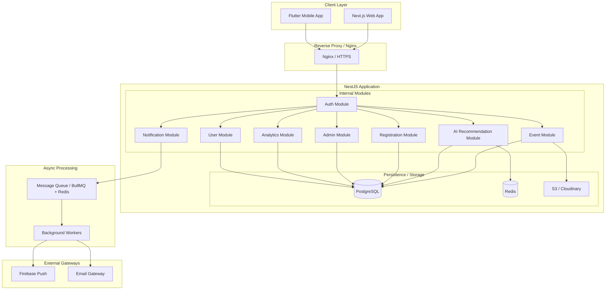
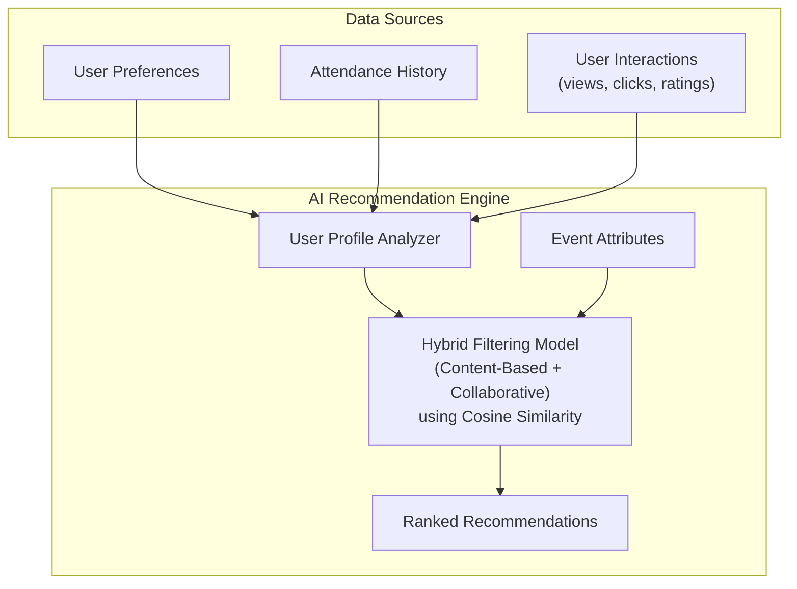

<h1 align="center">AASTU Campus Event Management System (CEMS)</h1>

<p align="center">
  <em>A centralized, ML-enhanced platform for managing campus events at Addis Ababa Science and Technology University</em>
</p>

<p align="center">
  
  
  
  
  
  
  
</p>

---

## Table of Contents

- [Overview](#overview)
- [Problem Statement](#problem-statement)
- [Key Features](#key-features)
- [System Architecture](#system-architecture)
- [Technology Stack](#technology-stack)
- [System Modules](#system-modules)
- [User Roles](#user-roles)
- [AI Recommendation Engine](#ai-recommendation-engine)
- [Security Design](#security-design)
- [Project Structure](#project-structure)
- [Team](#team)

---

## Overview

**AASTU CEMS** is a comprehensive Campus Event Management System designed for Addis Ababa Science and Technology University (AASTU). The system provides a unified digital platform that replaces fragmented communication methods (notice boards, word-of-mouth, scattered social media) with a centralized solution for:

- **Event Creation & Scheduling** — Organizers can create, manage, and promote events
- **Event Discovery** — Students can browse, search, and filter campus events
- **AI-Powered Recommendations** — Personalized event suggestions based on interests and behavior
- **Digital Registration & Attendance** — RSVP management with QR code-based check-in
- **Feedback & Analytics** — Post-event ratings and comprehensive analytics dashboards
- **Multi-channel Notifications** — In-app and email alerts for event updates

The system supports both **web** (Next.js) and **mobile** (Flutter) platforms, ensuring accessibility for all stakeholders across the AASTU campus community.

---

## Problem Statement

At AASTU, event management currently relies on:

| Current Approach | Issue |
|:---|:---|
| Physical notice boards & posters | Limited reach, easily missed |
| Word-of-mouth announcements | Inconsistent and unreliable |
| Scattered social media posts | Fragmented, no coordination |
| No centralized calendar | Frequent scheduling conflicts |
| Manual attendance tracking | Inaccurate, time-consuming |
| No feedback mechanism | No way to improve event quality |
| Generic announcements | No personalization for students |

**CEMS solves these problems** by providing a single, integrated platform with intelligent features that improve coordination, increase participation, and enable data-driven decision making.

---

## Key Features

### User Management & Authentication
- Secure registration and login (email/phone)
- Role-Based Access Control (RBAC): **Student**, **Organizer**, **Admin**
- JWT-based stateless authentication
- Profile management with interest preferences

### Core Event Management
- Full event lifecycle: create, edit, publish, approve, delete
- Administrative approval workflow for organizer-submitted events
- Event categorization (workshops, seminars, competitions, etc.)
- Scheduling conflict detection
- Media upload for event posters/banners

### Event Discovery & Search
- Centralized event calendar and listing
- Filter by category, date, department, popularity
- Keyword-based search
- Role-aware browsing (students see approved events, organizers see their own, admins see all)

### AI-Based Event Recommendation
- Personalized suggestions based on user interests, past attendance, and popularity
- Hybrid filtering: content-based + collaborative approaches
- Continuous learning from user interactions (views, clicks, ratings)
- Cold-start handling strategies

### Event Participation
- RSVP system ("Interested" / "Going")
- Organizer approval workflow for RSVPs
- Seat assignment and digital badge generation
- QR code-based attendance tracking and check-in

### Notifications & Alerts
- Real-time in-app notifications
- Email integration
- Event reminders, updates, and cancellation alerts
- New event notifications matching user interests

### Analytics & Reporting
- Event views, RSVPs, attendance rates, feedback summaries
- Participation trends over time
- Organizer and admin dashboards
- Data-driven insights for future event planning

### Feedback & Ratings
- Post-event rating and comment submission
- Feedback data feeds into AI recommendation engine
- Aggregated feedback reports for organizers

---

## System Architecture

CEMS follows a **Modular Monolith** architecture using NestJS — providing the organizational benefits of microservices (clear module boundaries, independent scaling) with the operational simplicity of a monolith.

### High-Level Architecture



### Why Modular Monolith?

| Feature | Modular Monolith | Microservices | Simple Monolith | Serverless |
|:---|:---|:---|:---|:---|
| **Dev Speed** | High | Low | Highest (initially) | Medium |
| **Complexity** | Medium | Very High | Low (until growth) | High |
| **Deployment** | Simple | Complex (K8s) | Simple | Simple |
| **Performance** | High (in-memory) | Medium (network) | High | Mixed (cold starts) |
| **AI Integration** | Seamless | Difficult (silos) | Messy | Costly (timeouts) |

> The Modular Monolith is the "Golden Middle" — fast development with clean code that can scale to microservices when needed.

---

## Technology Stack

| Layer | Technology | Purpose |
|:---|:---|:---|
| **Frontend (Web)** | Next.js, TailwindCSS, React Query | SSR, responsive UI, data fetching |
| **Mobile App** | Flutter | Cross-platform (Android & iOS) |
| **Backend** | NestJS (Node.js) | RESTful API, business logic |
| **Database** | PostgreSQL | Primary relational data store (ACID) |
| **Cache & Queue** | Redis + BullMQ | Caching, async task processing |
| **Real-time** | Socket.IO (NestJS Gateways) | WebSocket-based in-app notifications |
| **Authentication** | JWT (access + refresh tokens) | Stateless session management |
| **File Storage** | S3 / Cloudinary | Event posters, profile photos |
| **Notifications** | Firebase Push, SendGrid, Twilio | Push, email |
| **Monitoring** | Prometheus + Grafana | Uptime, logs, performance |
| **CI/CD** | GitHub Actions | Automated builds & deployments |
| **Containerization** | Docker | Consistent environments |
| **Version Control** | Git & GitHub | Source code management |
| **Design** | Figma | UI/UX prototyping |

---

## System Modules

| Module | Responsibility |
|:---|:---|
| **Auth Module** | Registration, login, JWT tokens, password management, RBAC |
| **User Module** | Profiles, preferences, interests, role management |
| **Event Module** | Event CRUD, categories/tags, schedule validation, conflict detection |
| **Registration Module** | RSVP, QR check-in, attendance tracking, capacity management |
| **Notification Module** | Real-time in-app (WebSocket), push, email via async queue with retry logic |
| **AI Recommendation Module** | Content-based + collaborative filtering, vector similarity, batched updates |
| **Analytics Module** | Participation metrics, trends, dashboards, report generation |
| **Media / Storage** | Image uploads, CDN delivery, lifecycle management |
| **Admin Module** | User management, system logging, audit, global settings |

---

## User Roles

### Student
- Browse and search approved events
- RSVP / mark interest
- Receive personalized AI recommendations
- Submit post-event feedback and ratings
- Manage interest preferences
- Receive notifications

### Event Organizer
- Create and manage events (pending admin approval)
- Upload event posters
- View RSVP requests and approve/reject
- Track event analytics
- Collect and view feedback

### Administrator
- Approve, update, or delete any event
- Manage user accounts and roles
- Monitor scheduling conflicts
- View system-wide analytics
- Oversee platform settings and announcements

---

## AI Recommendation Engine

The recommendation engine provides personalized event suggestions using a hybrid approach:



**Key aspects:**
- **User interest vectors** computed from stated preferences, past attendance, interactions
- **Cosine similarity** algorithm matches users to relevant events
- **Continuous learning** from views, clicks, RSVPs, and feedback
- **Cold-start handling** using popular events and category-based defaults
- **Batch processing** for model updates (offline training pipeline)
- **Low-latency inference** via Redis-cached results

---

## Security Design

CEMS implements a layered security architecture:

| Layer | Mechanism |
|:---|:---|
| **Authentication** | JWT access/refresh tokens, bcrypt/argon2 password hashing |
| **Authorization** | RBAC (Student, Organizer, Admin) enforced via middleware |
| **Data Transmission** | HTTPS/TLS everywhere, encrypted in transit |
| **Database** | PostgreSQL access control, row-level security, encrypted backups |
| **Input Validation** | Multi-layer validation (client + server), XSS/SQL injection prevention |
| **QR Check-in** | Signed, time-limited tokens, replay/tamper detection |
| **Rate Limiting** | Brute-force protection on sensitive endpoints |
| **Monitoring** | Operational logging, anomaly detection, audit trails |
| **Dependencies** | Regular audits, automated vulnerability alerts |

---

## Project Structure

```
AASTU-Campus-Event-Management-System/
├── apps/
│   ├── web/                    # Next.js web application
│   │   ├── src/
│   │   │   ├── components/     # Reusable UI components
│   │   │   ├── pages/          # Next.js pages/routes
│   │   │   ├── hooks/          # Custom React hooks
│   │   │   ├── services/       # API service layer
│   │   │   └── styles/         # TailwindCSS styles
│   │   └── public/             # Static assets
│   │
│   ├── mobile/                 # Flutter mobile application
│   │   ├── lib/
│   │   │   ├── models/         # Data models
│   │   │   ├── screens/        # App screens
│   │   │   ├── widgets/        # Custom widgets
│   │   │   └── services/       # API services
│   │   └── assets/             # Mobile assets
│   │
│   └── api/                    # NestJS backend application
│       ├── src/
│       │   ├── auth/           # Authentication module
│       │   ├── users/          # User management module
│       │   ├── events/         # Event management module
│       │   ├── registration/   # RSVP & attendance module
│       │   ├── notifications/  # Notification module
│       │   ├── recommendation/ # AI recommendation module
│       │   ├── analytics/      # Analytics module
│       │   ├── media/          # Media/storage module
│       │   └── admin/          # Administration module
│       └── test/               # Test files
│
├── docs/                       # Project documentation
├── docker-compose.yml          # Docker orchestration
├── .github/
│   └── workflows/              # CI/CD pipelines
└── README.md
```

---

## Team

| Name | ID | Role |
|:---|:---|:---|
| Miraf Debebe | ETS 1110/14 | Team Member |
| Mistire Daniel | ETS 1115/14 | Team Member |
| Nasifay Chala | ETS 1195/14 | Team Member |
| Natan Addis | ETS 1199/14 | Team Member |
| Nathnael Keleme | ETS 1222/14 | Team Member |

**Advisor:** Inst. Befekadu Belete

**Institution:** Addis Ababa Science and Technology University — College of Engineering, Department of Software Engineering

---
