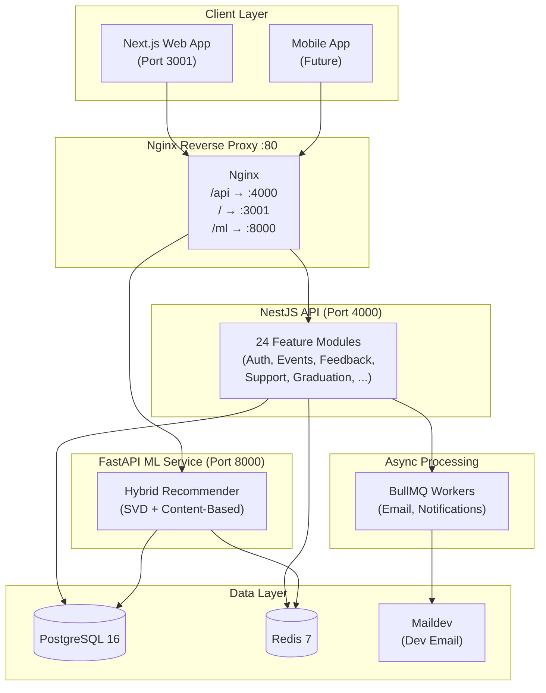
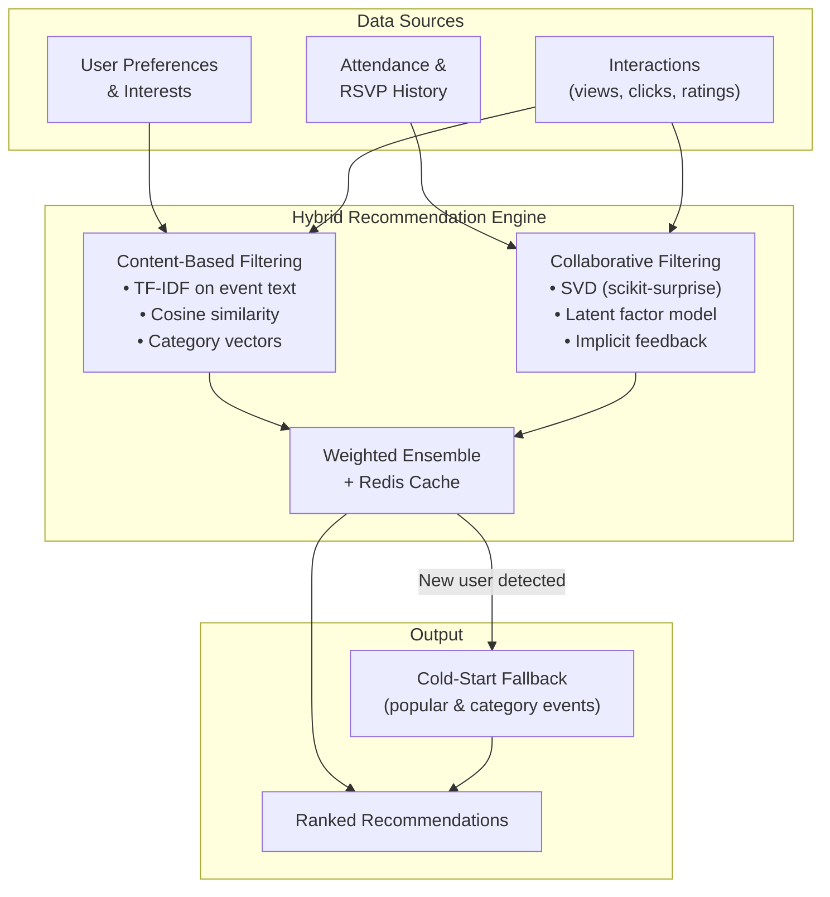

<h1 align="center">AASTU Campus Event Management System (CEMS)</h1>

<p align="center">
  <em>A production-ready, ML-enhanced platform for managing campus events at Addis Ababa Science and Technology University</em>
</p>

<p align="center">
  
  
  
  
  
  
  
  
</p>

---

## Table of Contents

- [Overview](#overview)
- [Problem Statement](#problem-statement)
- [System Architecture](#system-architecture)
- [Technology Stack](#technology-stack)
- [Key Features](#key-features)
- [System Modules](#system-modules)
- [User Roles & Permissions](#user-roles--permissions)
- [AI Recommendation Engine](#ai-recommendation-engine)
- [Security Design](#security-design)
- [Infrastructure & Deployment](#infrastructure--deployment)
- [API Documentation](#api-documentation)
- [Project Structure](#project-structure)
- [Getting Started](#getting-started)
- [Environment Variables](#environment-variables)
- [Database Schema](#database-schema)
- [Team](#team)

---

## Overview

**AASTU CEMS** is a comprehensive, full-stack Campus Event Management System built for Addis Ababa Science and Technology University. It replaces fragmented, manual event workflows with a centralized digital platform that serves Students, Event Organizers, and Administrators.

The system is composed of three main applications:

| App | Technology | Purpose |
|:----|:-----------|:--------|
| **`apps/api`** | NestJS 11 + Prisma 7 | RESTful API, WebSocket gateway, business logic |
| **`apps/web`** | Next.js 14 (App Router) + Shadcn UI | Primary web dashboard and student portal |
| **`apps/ml-service`** | FastAPI + scikit-surprise | Hybrid ML recommendation engine |

All services are orchestrated via **Docker Compose** and sit behind an **Nginx** reverse proxy.

---

## Problem Statement

| Current Approach | Issue |
|:----------------|:------|
| Physical notice boards & posters | Limited reach, easily missed |
| Word-of-mouth announcements | Inconsistent and unreliable |
| Scattered social media posts | Fragmented, no coordination |
| No centralized calendar | Frequent scheduling conflicts |
| Manual attendance tracking | Inaccurate, time-consuming |
| No feedback mechanism | No way to improve event quality |
| Generic announcements | No personalization for students |
| No graduation guest-pass workflow | Manual, error-prone distribution |

---

## System Architecture

CEMS follows a **Modular Monolith** architecture using NestJS — providing clean module boundaries (close to microservices) with the operational simplicity of a monolith. The ML service runs as a separate Python process.



---

## Technology Stack

### Backend (`apps/api`)

| Technology | Version | Purpose |
|:-----------|:--------|:--------|
| NestJS | 11 | Framework, DI, module system |
| Prisma | 7 | ORM with PostgreSQL adapter (`@prisma/adapter-pg`) |
| PostgreSQL | 16 | Primary relational database |
| Redis | 7 | Caching, BullMQ job queue backend |
| BullMQ | 5 | Async job processing (emails, notifications) |
| Socket.IO | 4 | WebSocket gateway (real-time support chat) |
| JWT | — | Stateless auth (access + refresh tokens) |
| Argon2 | — | Password hashing |
| Nodemailer | 8 | Transactional email (SMTP) |
| Swagger/OpenAPI | 11 | Auto-generated API documentation at `/api/docs` |
| Telegraf | 4 | Telegram Bot SDK for guest pass delivery |

### Frontend (`apps/web`)

| Technology | Version | Purpose |
|:-----------|:--------|:--------|
| Next.js | 14 (App Router) | SSR/SSG, routing, server components |
| Shadcn UI | — | Accessible component library (Radix primitives) |
| Tailwind CSS | 3 | Utility-first styling |
| TanStack Query | — | Server state management, caching, mutations |
| Zustand | — | Client-side auth state, theme persistence |
| Socket.IO Client | — | Real-time support ticket chat |
| Cloudinary | — | Image upload and CDN delivery |

### ML Service (`apps/ml-service`)

| Technology | Purpose |
|:-----------|:--------|
| FastAPI (Python) | REST API for recommendations |
| scikit-surprise | SVD collaborative filtering |
| scikit-learn | Content-based filtering, cosine similarity |
| Pandas / NumPy | Data processing |
| APScheduler | Periodic model retraining |
| Redis | Result caching for low-latency inference |

---

## Key Features

###  Authentication & Authorization

- Secure registration with **email verification** (one-time token flow)
- JWT **access + refresh token** pair with session management
- **Role-Based Access Control (RBAC)**: Student, Organizer, Admin
- Fine-grained **permission system** (per-role permission assignments)
- Password reset via time-limited email links
- **Brute-force protection** and rate limiting on sensitive endpoints
- Full **audit log** trail of all user and admin actions

###  Event Lifecycle Management

- Full event CRUD with rich metadata: title, description, venue, start/end time, capacity, type, categories, tags
- **Event types** and **categories** management by admins
- Administrative **approval workflow** for organizer-submitted events
- **Scheduling conflict detection** based on venue + time overlap
- **Event archiving** — archived events automatically trigger feedback email dispatch
- Event **media uploads** (posters, banners) via Cloudinary
- **Announcement broadcasts** to registered attendees

###  Event Discovery

- Centralized event listing with rich filtering (category, date, type, status)
- Keyword search across events
- **Bookmark system** — users can save events for later
- Role-aware browsing (students see published events; organizers see their own; admins see all)
- Personalized **"For You"** feed powered by the ML recommendation engine

###  Registration & Attendance

- **RSVP system** with organizer approval workflow
- **QR code** generation for registered attendees
- QR code-based **check-in** at event entry
- Session-level attendance tracking (for multi-session events)
- **Waitlist** management with automatic promotion
- **Guest invite system** — organizers can invite external guests by email
- Dynamic **registration forms** with custom fields per event

###  Graduation Ceremony System

A specialized feature for managing the graduation ceremony:

- **CSV bulk import** of graduating students (name, GPA, email)
- **Tiered guest-pass allocation** based on GPA (e.g., 3.75+ GPA → 3 passes, etc.)
- Per-student **unique claim token** sent via email
- **Public claim portal** — graduating students fill in guest details without login
- Guest pass delivery via **Email** or **Telegram** (QR code sent directly to Telegram)
- **Resend delivery** capability for failed or missed notifications
- PDF generation with QR codes for physical guest passes
- Admin can view the full student roster and pass status per graduation event

###  Advanced Feedback System

A token-gated, structured post-event feedback system:

- **Automatic email dispatch** when an event is archived — sends a personalized JWT-secured feedback link to all confirmed attendees
- **Public feedback form** accessible without login via time-limited JWT token (14-day window)
- **Customizable feedback form templates** (Organizer/Admin):
  - Question types: `RATING`, `TEXT`, `SHORT_TEXT`, `MULTIPLE_CHOICE`, `SCALE`
  - Organizers create reusable templates and attach them to specific events
  - Falls back to a **built-in default template** if no custom template is assigned
- **Idempotent token handling** — safe to re-dispatch; already-submitted feedback is skipped
- **Role-separated response views**:
  - Admins: full respondent identity (name, email)
  - Organizers: semi-anonymous view (masked name & email)
- Paginated response listings for admin and organizer dashboards

###  Support Ticket System

A full-featured help desk with real-time chat:

- **Guest ticket creation** — unauthenticated users can open tickets (tracked by email)
- **Public ticket tracking** — guests can view their ticket status by ID + email
- Ticket categorization: `TECHNICAL`, `ACCOUNT`, `EVENT_ISSUE`, `EMERGENCY`, `OTHER`
- Priority levels: `LOW`, `MEDIUM`, `HIGH`, `URGENT`
- Status workflow: `OPEN` → `IN_PROGRESS` → `RESOLVED` → `CLOSED`
- **Real-time WebSocket chat** (Socket.IO) between users/guests and admins
- Admin dashboard with ticket metrics (unresolved, in-progress, resolved, closed counts)
- Filterable data table by status, priority, and category
- **Target role routing** — tickets can be directed to specific admin roles

###  Notifications

- **Real-time in-app notifications** via WebSocket
- **Transactional emails** for:
  - Email verification
  - Password reset
  - Event registration confirmation
  - Feedback requests (post-event)
  - Graduation guest-pass claim links
  - Telegram guest pass delivery
- **BullMQ background queue** for reliable async email processing with retry logic

###  Analytics & Dashboards

- Admin overview: total events, users, registrations, attendance rates
- Per-event analytics: views, RSVPs, check-in counts, feedback scores
- **Activity feed** — real-time log of system events
- **Audit logs** — forensic trail of admin actions with before/after state, IP address, user agent
- Organizer dashboard: performance metrics for their events
- Charts and trend visualization on the main dashboard page

###  AI-Powered Recommendations

See the [AI Recommendation Engine](#ai-recommendation-engine) section below.

###  Theme & UI

- **Persistent light/dark mode** via Zustand + CSS variables
- Role-based **sidebar navigation** (Shadcn Sidebar) with context-aware collapsible groups:
  - Student: Discovery, My Events, Bookmarks, Notifications, Support, Profile
  - Organizer: above + Event Management, Feedback, Invitations
  - Admin: above + Users, Venues, Departments, Categories, Tags, Audit Logs, Archive
- Smooth scroll and micro-animation system
- Responsive design for all viewport sizes

---

## System Modules

### Backend API Modules (24 total)

| Module | Key Responsibilities |
|:-------|:--------------------|
| **Auth** | Registration, login, JWT tokens, email verification, password reset, refresh token rotation |
| **Users** | Profile management, interest preferences, campus ID verification |
| **Roles & Permissions** | RBAC system, role assignment, fine-grained permission control |
| **Events** | Event CRUD, approval workflow, conflict detection, archiving, announcements |
| **Registration** | RSVP, dynamic form fields, QR code generation, waitlist |
| **Attendance** | QR check-in, session attendance, reporting |
| **Bookmarks** | User event bookmarks |
| **Invitations** | Guest invites (email-based), status tracking |
| **Notifications** | WebSocket gateway, email queue via BullMQ |
| **Feedback** | Token-based feedback, templates, responses, anonymized views |
| **Support** | Ticket CRUD, WebSocket real-time chat, guest ticket support |
| **Graduation** | CSV import, tiered guest passes, Telegram delivery, claim portal |
| **Analytics** | Dashboards, event metrics, participation trends |
| **Audit Logs** | Forensic action trail with context (IP, user agent, before/after state) |
| **Recommendation** | Proxy to ML service, result caching |
| **Telegram** | Bot integration for guest pass QR delivery |
| **Media** | Cloudinary upload integration |
| **Departments** | Department management |
| **Admin** | User management, system settings |
| **Health** | Health check endpoint for infrastructure monitoring |
| **Prisma** | Database connection pool via `@prisma/adapter-pg` |
| **Config** | Joi-validated environment configuration |
| **Common** | Global filters, interceptors (logging, transform), guards |

---

## User Roles & Permissions

### Student
- Browse and search published events
- RSVP and join waitlists
- Receive personalized AI recommendations
- Submit token-gated post-event feedback
- Bookmark events for later
- Manage interest preferences and profile
- Create and track support tickets

### Event Organizer
- All Student capabilities
- Create and manage events (pending admin approval)
- Upload event media (posters, banners)
- Manage RSVPs, approve/reject registrations
- Invite external guests by email
- Create and manage feedback form templates
- View (semi-anonymized) feedback responses for their events
- Import graduation student lists via CSV
- Manage guest pass delivery

### Administrator
- All Organizer capabilities
- Approve, reject, or delete any event
- Manage all user accounts and roles
- View full (non-anonymized) feedback data system-wide
- View and manage all support tickets
- Access full audit logs with forensic detail
- Manage system-wide categories, tags, venues, departments, event types
- Archive events and trigger feedback email dispatch
- View system analytics and activity feed

---

## AI Recommendation Engine

The ML service (`apps/ml-service`) is a standalone **FastAPI** application implementing a **Hybrid Recommendation System**:



**Key aspects:**
- **User interest vectors** from stated preferences, past attendance, and interactions
- **SVD collaborative filtering** discovers latent user-event relationships
- **Cold-start handling**: falls back to popular events and category defaults for new users
- **APScheduler** periodically retrains models in the background
- **Redis caching** for sub-100ms inference latency
- Evaluation metrics: Precision@K, Recall@K, NDCG@K, Coverage

---

## Security Design

| Layer | Mechanism |
|:------|:----------|
| **Authentication** | JWT access/refresh tokens, Argon2 password hashing |
| **Authorization** | RBAC with fine-grained permissions enforced at route level |
| **Session Security** | Refresh token rotation, session revocation |
| **Data Transmission** | HTTPS/TLS via Nginx, CORS restricted to known origins |
| **Input Validation** | Global `ValidationPipe` (class-validator), whitelist-only, forbid unknown |
| **QR Check-in** | Signed tokens, tamper-resistant, replay detection |
| **Rate Limiting** | Brute-force protection on auth and sensitive endpoints |
| **Audit Trail** | All admin actions logged with IP, user agent, before/after state |
| **Secrets** | Environment variable injection, no secrets in source code |
| **Feedback Tokens** | SHA-256 hashed JWT, 14-day expiry, single-use enforced |

---

## Infrastructure & Deployment

The project ships with a complete **Docker Compose** setup:

| Container | Image | Port | Purpose |
|:----------|:------|:-----|:--------|
| `cems-api` | Custom NestJS | 4000 | Backend API (live reload in dev) |
| `cems-web` | Custom Next.js | 3001 | Web frontend (live reload in dev) |
| `cems-ml-service` | Custom FastAPI | 8000 | ML recommendation service |
| `cems-nginx` | Custom Nginx | 80 | Reverse proxy & routing |
| `cems-postgres` | postgres:16-alpine | 5433 | Primary database |
| `cems-postgres-test` | postgres:16-alpine | 5434 | Test database |
| `cems-redis` | redis:7-alpine | 6379 | Cache & job queue |
| `cems-maildev` | maildev:2.1.0 | 1080/1025 | Local email catcher (dev UI at :1080) |

```
Client Request
     │
     ▼
Nginx :80
  ├── /api/*  ──► NestJS :4000
  ├── /*      ──► Next.js :3001
  └── /ml/*   ──► FastAPI :8000
```

---

## API Documentation

The API is fully documented with **Swagger/OpenAPI** and accessible at:

```
http://localhost/api/docs
```

All endpoints are grouped by feature tag and support JWT Bearer authentication directly from the Swagger UI.

---

## Project Structure

```
AASTU-Campus-Event-Management-System/
├── apps/
│   ├── api/                          # NestJS Backend
│   │   ├── prisma/
│   │   │   ├── schema.prisma         # Database schema (30+ models)
│   │   │   ├── migrations/           # Prisma migration history
│   │   │   └── seed/                 # Seed scripts (roles, users, events)
│   │   └── src/
│   │       ├── admin/                # Admin utilities
│   │       ├── analytics/            # Analytics & dashboards
│   │       ├── attendance/           # QR check-in
│   │       ├── audit-logs/           # Forensic audit trail
│   │       ├── auth/                 # JWT, email, guards, decorators
│   │       ├── bookmarks/            # Event bookmarks
│   │       ├── common/               # Filters, interceptors, pipes
│   │       ├── config/               # Joi env validation
│   │       ├── departments/          # Department management
│   │       ├── events/               # Full event lifecycle
│   │       ├── feedback/             # Token-based feedback system
│   │       ├── graduation/           # Graduation ceremony feature
│   │       ├── health/               # Health check
│   │       ├── media/                # File uploads (Cloudinary)
│   │       ├── notifications/        # WebSocket + BullMQ
│   │       ├── permission/           # Permission management
│   │       ├── prisma/               # PrismaService (connection pool)
│   │       ├── recommendation/       # ML proxy module
│   │       ├── registration/         # RSVP & waitlist
│   │       ├── role/                 # Role management
│   │       ├── support/              # Help desk + WebSocket gateway
│   │       ├── telegram/             # Telegram bot service
│   │       └── users/                # User profiles & preferences
│   │
│   ├── web/                          # Next.js 14 Frontend
│   │   └── src/
│   │       ├── app/
│   │       │   ├── (auth)/           # Login, register, verify
│   │       │   ├── (dashboard)/      # Protected dashboard routes
│   │       │   │   └── dashboard/
│   │       │   │       ├── page.tsx  # Main analytics dashboard
│   │       │   │       ├── events/   # Event management
│   │       │   │       ├── users/    # User management (admin)
│   │       │   │       ├── feedback/ # Feedback responses
│   │       │   │       ├── support/  # Support tickets
│   │       │   │       ├── invitations/ # Guest invitations
│   │       │   │       ├── attendance/  # Attendance tracking
│   │       │   │       ├── archive/  # Archived events
│   │       │   │       ├── venues/   # Venue management
│   │       │   │       ├── departments/ # Department management
│   │       │   │       ├── categories/  # Category management
│   │       │   │       ├── tags/     # Tag management
│   │       │   │       ├── activity/ # Activity feed
│   │       │   │       └── profile/  # User profile
│   │       │   ├── discovery/        # Public event discovery
│   │       │   ├── feedback/         # Public feedback form (token-gated)
│   │       │   └── graduation/       # Public graduation claim portal
│   │       ├── components/
│   │       │   ├── cems/             # CEMS-specific: Sidebar, Sheet, etc.
│   │       │   ├── theme/            # ThemeProvider, ThemeToggle
│   │       │   └── ui/               # Shadcn UI components
│   │       ├── features/             # Feature-sliced modules
│   │       │   ├── auth/             # Auth forms, hooks, stores
│   │       │   ├── discovery/        # Event discovery & search
│   │       │   ├── events/           # Event CRUD components
│   │       │   ├── feedback/         # Feedback components & API
│   │       │   ├── notifications/    # Notification center
│   │       │   ├── recommendations/  # AI suggestions
│   │       │   └── support/          # Ticket UI, real-time chat
│   │       └── lib/
│   │           ├── api-client.ts     # Typed Axios wrapper
│   │           └── utils.ts          # Shared utilities
│   │
│   └── ml-service/                   # FastAPI ML Recommendation Service
│       ├── app/
│       │   ├── main.py               # FastAPI entry point
│       │   ├── features/             # Feature engineering
│       │   ├── models/               # ML model wrappers
│       │   ├── services/             # Business logic (train, predict)
│       │   ├── schemas/              # Pydantic request/response models
│       │   └── scheduler/            # APScheduler retraining jobs
│       ├── notebooks/                # Model evaluation notebooks
│       ├── trained_models/           # Serialized model artifacts
│       └── requirements.txt
│
├── nginx/                            # Nginx configuration & Dockerfile
├── docker-compose.yml                # Full stack orchestration
├── package.json                      # Monorepo scripts (npm workspaces)
└── .env.example                      # Environment variable template
```

---

## Getting Started

### Prerequisites

- [Docker](https://docs.docker.com/get-docker/) & Docker Compose
- Node.js 20+ (for local development outside Docker)

### 1. Clone & Configure

```bash
git clone https://github.com/your-org/AASTU-Campus-Event-Management-System.git
cd AASTU-Campus-Event-Management-System

# Copy and configure environment variables
cp .env.example .env
# Edit .env with your settings (see Environment Variables section below)
```

### 2. Start All Services

```bash
# First run — builds all images
docker compose up --build

# Subsequent runs
docker compose up
```

This starts all 8 containers. Services are available at:

| Service | URL |
|:--------|:----|
| Web App | http://localhost |
| API | http://localhost/api |
| Swagger Docs | http://localhost/api/docs |
| ML Service | http://localhost:8000 |
| Maildev (email UI) | http://localhost:1080 |

### 3. Run Database Migrations

On first startup, migrations run automatically in the API container. To run manually:

```bash
docker compose exec api npx prisma migrate deploy
```

### 4. Seed the Database

```bash
docker compose exec api npm run script_roles
docker compose exec api npm run script_users
docker compose exec api npm run script_events
```

### 5. Local Development (without Docker)

```bash
# Start only infrastructure services
docker compose up postgres redis maildev -d

# Run API locally
cd apps/api
npm install
npm run prisma:generate
npm run start:dev

# Run Web locally (in a separate terminal)
cd apps/web
npm install
npm run dev
```

---

## Environment Variables

Copy `.env.example` to `.env` and fill in all values:

```env
# Database
POSTGRES_USER=cems
POSTGRES_PASSWORD=cems_secret
POSTGRES_DB=cems_db

# JWT
JWT_SECRET=your-super-secret-key
JWT_REFRESH_SECRET=your-refresh-secret
JWT_EXPIRATION=2h
JWT_REFRESH_EXPIRATION=7d

# SMTP (use Maildev defaults for local dev)
SMTP_HOST=maildev
SMTP_PORT=1025
SMTP_FROM=noreply@cems.local

# App URLs
BACKEND_URL=http://localhost/api
FRONTEND_URL=http://localhost

# Cloudinary (for image uploads)
NEXT_PUBLIC_CLOUDINARY_CLOUD_NAME=your-cloud-name
NEXT_PUBLIC_CLOUDINARY_UPLOAD_PRESET=your-preset

# Telegram Bot (optional — for graduation guest pass delivery)
TELEGRAM_BOT_TOKEN=your-bot-token
TELEGRAM_BOT_USERNAME=your-bot-username

# ML Service
ML_SERVICE_URL=http://ml-service:8000
```

---

## Database Schema

The PostgreSQL schema (managed via Prisma) contains **30+ models** across these domains:

| Domain | Models |
|:-------|:-------|
| **Identity** | `User`, `Role`, `Permission`, `RolePermission`, `Department` |
| **Auth** | `AuthSession`, `OneTimeToken` |
| **Events** | `Event`, `EventStatus`, `EventType`, `EventCategory`, `EventAccess` |
| **Content** | `Category`, `Tag`, `EventTags`, `Venue`, `EventMedia`, `EventSessions` |
| **Participation** | `Registration`, `RegistrationStatus`, `Attendance`, `EventWaitlist` |
| **Invitations** | `EventInvites`, `EventOrganizers`, `EventBookmark` |
| **Forms** | `FormFields`, `FormResponses` |
| **Hackathons** | `Hackathons`, `Teams`, `TeamMembers`, `Submissions`, `Judges`, `Scores` |
| **Feedback** | `FeedbackFormTemplate`, `FeedbackQuestion`, `EventFeedbackTemplate`, `FeedbackToken`, `FeedbackResponse`, `FeedbackAnswer` |
| **Graduation** | `GraduationRecord`, `GuestPass` |
| **Support** | `SupportTicket`, `SupportMessage` |
| **System** | `Notification`, `AuditLogs`, `Announcements`, `Feedback` |

View the full schema at [`apps/api/prisma/schema.prisma`](apps/api/prisma/schema.prisma).

---

## Team

| Name | ID | Role |
|:-----|:---|:-----|
| Miraf Debebe | ETS 1110/14 | Team Member |
| Mistire Daniel | ETS 1115/14 | Team Member |
| Nasifay Chala | ETS 1195/14 | Team Member |
| Natan Addis | ETS 1199/14 | Team Member |
| Nathnael Keleme | ETS 1222/14 | Team Member |

**Advisor:** Inst. Befekadu Belete

**Institution:** Addis Ababa Science and Technology University — College of Engineering, Department of Software Engineering

---

<p align="center">
  Built with  by the AASTU Software Engineering Class of 2026
</p>
